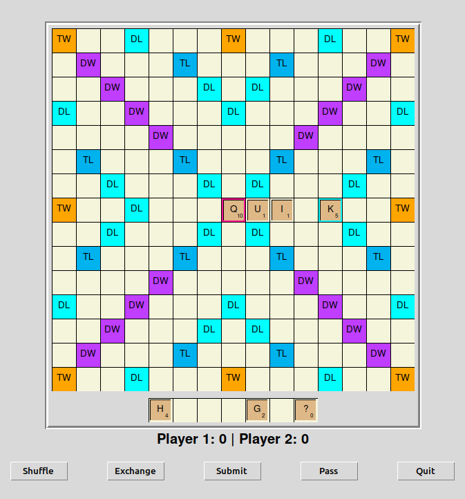
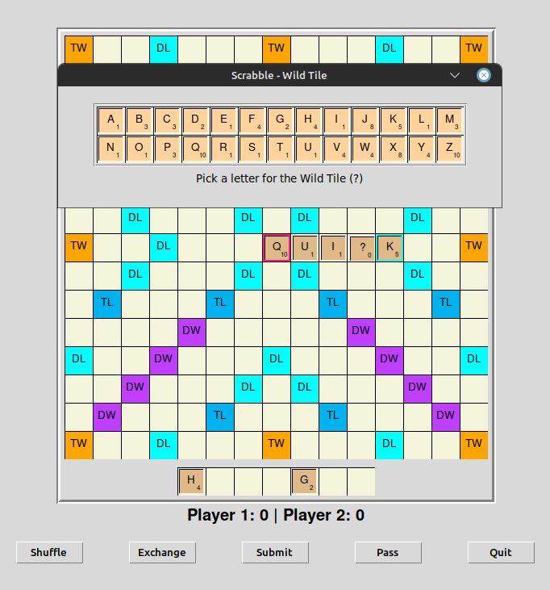
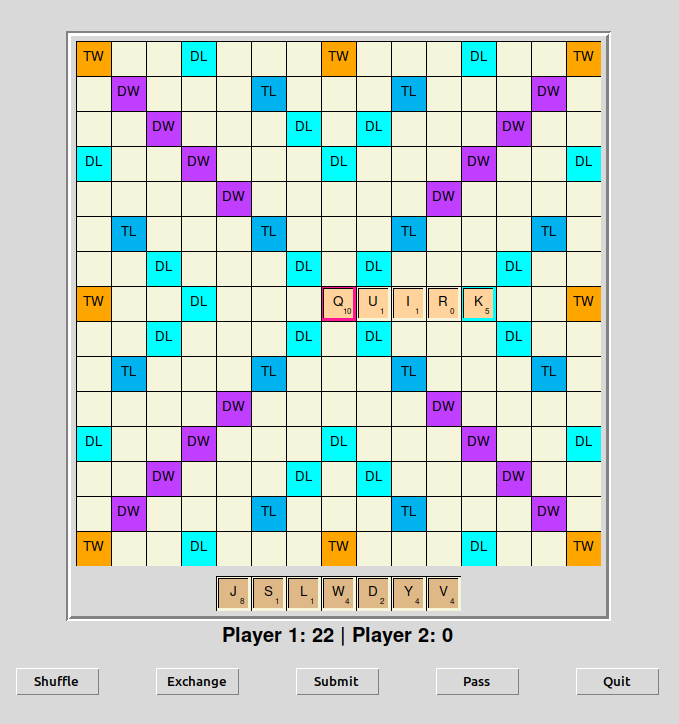
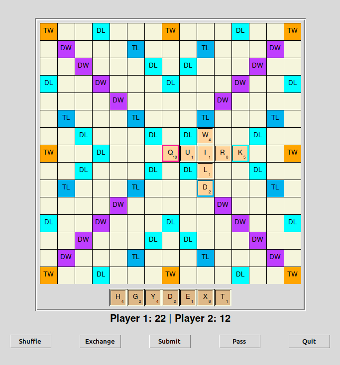

# Scrabified
Scrabble game

First move, we need R to play the work QUIRK.

We use Wildcard tile for tile R

We then submit the play

Second player plays WILD, using a tile from the existing QUIRK

